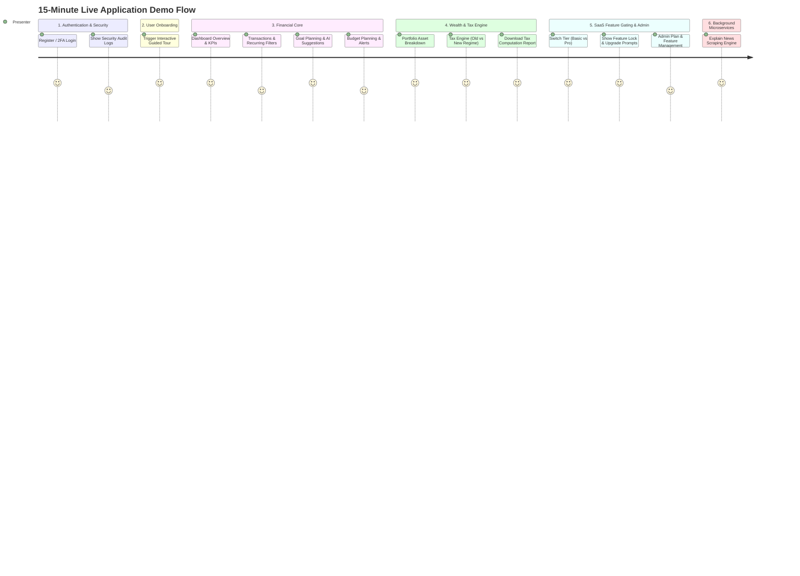
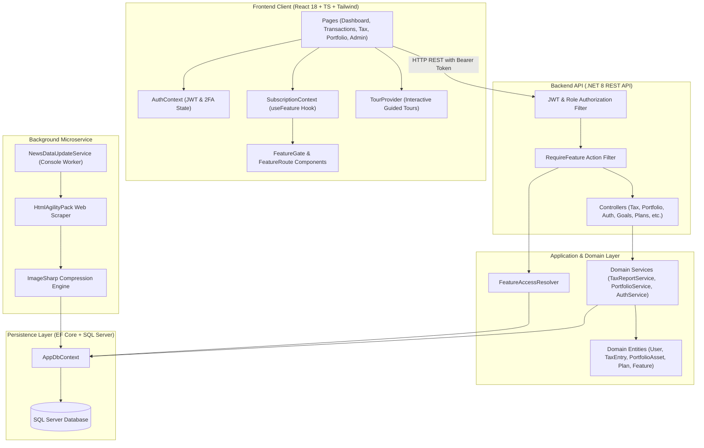
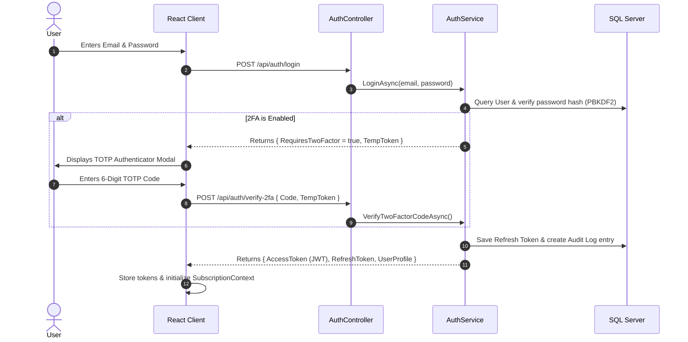
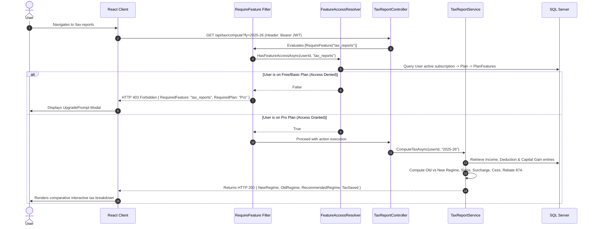
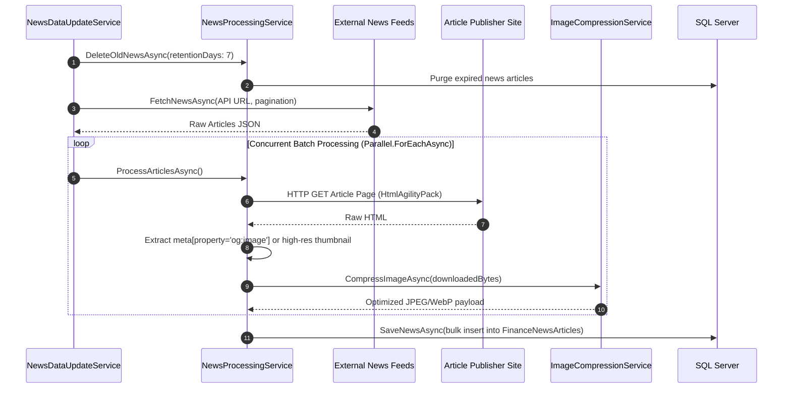

# Financial Application (FinTech SaaS) — Master Demo & Architecture Guide

---

## Executive Summary & Project Pitch

**The Financial Application** is an enterprise-grade, multi-tier Financial SaaS Platform built on **Clean Architecture (.NET 8)** and **React 18 (TypeScript + Tailwind CSS)**. 

Unlike conventional expense trackers, this platform delivers a **complete personal wealth ecosystem** integrating:
1. **Real-time Financial Ingestion & High-Concurrency News Scraping Engine** with background image optimization.
2. **Dynamic 4-Tier Subscription & Feature Gating Engine** (Free, Basic, Advanced, Pro) enforced seamlessly across both backend API filters and frontend route/component guards.
3. **Comprehensive Personal Finance Suite**: Multi-category Transactions, Goal Tracking with AI recommendations, Portfolio Asset Management, and Category Budgeting.
4. **Statutory Tax Computation Engine (Indian Income Tax Act FY 2025-26 / AY 2026-27)**: Automatic side-by-side comparative analysis of Old vs. New Tax Regimes, Capital Gains (STCG @ 20%, LTCG @ 12.5% above ₹1.25L exemption), Surcharge, 4% Health & Education Cess, Section 87A rebate, and downloadable tax computation reports.
5. **Enterprise Security & Compliance**: Multi-Factor Authentication (TOTP 2FA), Email verification codes, one-time Emergency Recovery Codes, Refresh Token rotation, and Immutable Security Audit Logging.
6. **Interactive User Onboarding Tour**: Built-in guided walkthrough assisting new users across complex financial capabilities.

---

## 1. Live Demo Presentation Script (10–15 Minute Flow)

Use this exact chronological walkthrough to present the live application to recruiters, stakeholders, or clients.

---

### Step 1: Authentication & Enterprise Security (2 Minutes)
* **What to Show on Screen**: 
  - Login page (`/login`) & 2FA Verification Modal (`/verify-2fa`).
  - Audit Log Viewer (`/audit-log`).
* **What to Say (Pitch)**:
  > *"We begin with security. The platform implements defense-in-depth: beyond standard JWT auth, we provide Time-based One-Time Password (TOTP) 2FA compatible with Google Authenticator and Microsoft Authenticator, single-use emergency recovery codes, and email verification tokens.*
  > *Every sensitive action—such as authentication, password updates, or permission escalations—is recorded in our immutable Audit Log service with client IP tracking and category tagging."*
* **Key Code to Reference**:
  - `FinancialApplication.Infrastructure/Services/AuthService.cs` (TOTP generation, recovery code hashing, JWT/Refresh token pairs).
  - `FinancialApplication.Api/Controllers/AuditController.cs` & `FinancialApplication.Domain/Domain/Entity/AuditLog.cs`.

---

### Step 2: Interactive Product Tour & Dashboard (2 Minutes)
* **What to Show on Screen**: 
  - Click the prominent **"Take Tour"** gradient button in the sidebar.
  - Watch the step-by-step highlight animations over Dashboard KPI cards, Expense Charts, and Navigation items.
* **What to Say (Pitch)**:
  > *"To ensure high user adoption and zero friction for non-technical users, we integrated an interactive tour system directly into the application layout. It dynamically identifies elements across the DOM and guides users through analytics, transaction logging, and wealth tracking."*
* **Key Code to Reference**:
  - `Frontend/src/tours/TourProvider.tsx` and `Frontend/src/Component/TourButton.tsx`.
  - `Frontend/src/pages/Dashboard/dashboard.tsx`.

---

### Step 3: Core Finance, Goals & Budgeting (3 Minutes)
* **What to Show on Screen**:
  - **Transactions (`/transaction`)**: Filter transactions, toggle "Recurring Transactions" (demonstrating Basic+ tier gating), click **"Export CSV"**.
  - **Goals (`/goals`)**: Target progress bars, contribution modal, and the **"Smart Goal Recommendations"** banner.
  - **Budget Planning (`/budget-planning`)**: Category limit cards (Food, Transport, Shopping), overspend warnings with visual badges.
* **What to Say (Pitch)**:
  > *"In our core financial modules, transactions support recurring schedules and CSV export. Our goal management module features intelligent target projections, while the Budget Planning system gives users real-time feedback on category thresholds with visual overspend indicators."*
* **Key Code to Reference**:
  - `FinancialApplication.Api/Controllers/TransactionController.cs` (gated with `[RequireFeature("transactions")]`).
  - `FinancialApplication.Api/Controllers/GoalController.cs`.
  - `Frontend/src/pages/finance/BudgetPlanning.tsx`.

---

### Step 4: Wealth Management & Statutory Tax Engine (4 Minutes)
* **What to Show on Screen**:
  - **Portfolio Management (`/portfolio-management`)**: Visual asset allocation bar (Equity, Mutual Funds, Gold, Fixed Income), profit & loss indicators, and per-asset return percentages.
  - **Tax Reports (`/tax-reports`)**:
    1. Show Income, Capital Gains (STCG/LTCG), and Deductions (80C, 80D, HRA).
    2. Show the **Side-by-Side Old vs. New Tax Regime comparison** calculated strictly as per Indian Income Tax Act (FY 2025-26).
    3. Point out the **Recommended Regime** badge and calculated tax savings.
    4. Click **"Export Report"** to download the formatted tax computation text file.
* **What to Say (Pitch)**:
  > *"Here is one of our primary USPs: the Statutory Tax Engine. Indian taxation underwent major reforms in Finance Act 2024. Our system implements full mathematical modeling for both the New Regime (revised slabs up to ₹15L+, ₹75,000 standard deduction, Section 87A rebate up to ₹7 Lakhs) and the Old Regime (80C/80D/HRA deductions).*
  > *It handles the new Capital Gains tax rates (STCG @ 20%, LTCG @ 12.5% above ₹1.25L exemption), Surcharge brackets, and 4% Health & Education Cess, advising the user on which regime saves them more money."*
* **Key Code to Reference**:
  - `FinancialApplication.Infrastructure/Services/TaxReportService.cs` (`ComputeTaxAsync`, `ComputeNewRegimeSlabs`, `GenerateReportPdfAsync`).
  - `FinancialApplication.Api/Controllers/TaxReportController.cs`.
  - `Frontend/src/pages/finance/TaxReports.tsx`.

---

### Step 5: Dynamic SaaS Subscription & Feature Gating (2 Minutes)
* **What to Show on Screen**:
  - Navigate to `/plans` or show locked features in the sidebar (lock icons + upgrade pills).
  - Admin view: `/admin/plans` and `/admin/features`.
* **What to Say (Pitch)**:
  > *"Our monetisation architecture is built on a 27-feature catalog mapped to 4 subscription tiers. What makes this unique is zero hardcoding: admins can create features and modify plan allocations dynamically.*
  > *On the backend, an endpoint is protected by a declarative `[RequireFeature("feature_key")]` attribute. On the frontend, `<FeatureGate>` and `<FeatureRoute>` handle graceful degradation, inline upgrade pills, or route redirection."*
* **Key Code to Reference**:
  - `FinancialApplication.Api/Attributes/RequireFeatureAttribute.cs`.
  - `FinancialApplication.Infrastructure/Services/FeatureAccessResolver.cs`.
  - `Frontend/src/Component/FeatureGate.tsx` & `Frontend/src/Component/FeatureRoute.tsx`.

---

### Step 6: High-Concurrency News Scraping Microservice (2 Minutes)
* **What to Show on Screen**:
  - News Feed on Dashboard or open `NewsDataUpdateService/Program.cs`.
* **What to Say (Pitch)**:
  > *"To provide financial intelligence, we engineered a dedicated background scraper worker (`NewsDataUpdateService`). It connects to financial news feeds, extracts full HTML content using `HtmlAgilityPack`, scrapes OpenGraph metadata, compresses downloaded images using `SixLabors.ImageSharp` to minimize bandwidth, and performs asynchronous parallel ingestion with configurable concurrency and automatic retention cleanup."*
* **Key Code to Reference**:
  - `NewsDataUpdateService/Program.cs`.
  - `FinancialApplication.Infrastructure/Services/NewsProcessingService.cs`.
  - `FinancialApplication.Infrastructure/Services/ImageCompressionService.cs`.

---

## 2. System Architecture & Workflow

### High-Level System Architecture Diagram

---

## 3. End-to-End API Call Sequences

### A. Authentication & 2FA Sequence

---

### B. Feature-Gated Request Sequence (e.g., Tax Computation)

---

### C. News Scraping & Image Processing Pipeline

---

## 4. Feature Catalog & Tier Matrix

The platform implements a **27-feature catalog** structured across 4 transparent tiers:

| Category | Feature Key | Display Name | Free | Basic | Advanced | Pro |
|---|---|---|:---:|:---:|:---:|:---:|
| **Core** | `dashboard` | Basic Dashboard | ✅ | ✅ | ✅ | ✅ |
| **Core** | `transactions` | Transactions & Categorization | ✅ | ✅ | ✅ | ✅ |
| **Core** | `goals_basic` | Financial Goals (Basic) | ✅ | ✅ | ✅ | ✅ |
| **Core** | `security_settings` | Security & 2FA Settings | ✅ | ✅ | ✅ | ✅ |
| **Automation** | `recurring_transactions`| Recurring Schedules | ❌ | ✅ | ✅ | ✅ |
| **Export** | `export_csv` | CSV Data Export | ❌ | ✅ | ✅ | ✅ |
| **Investments**| `investment_tracking` | Investment Asset Tracking | ❌ | ✅ | ✅ | ✅ |
| **Cards** | `cards` | Card Management | ❌ | ✅ | ✅ | ✅ |
| **Analytics** | `reports` | Reports & Visual Analytics | ❌ | ❌ | ✅ | ✅ |
| **Budgeting** | `budget_planning` | Monthly Category Budgets | ❌ | ❌ | ✅ | ✅ |
| **Intelligence**| `goal_recommendations`| AI-Powered Goal Insights | ❌ | ❌ | ✅ | ✅ |
| **Export** | `export_pdf` | PDF Report Generation | ❌ | ❌ | ✅ | ✅ |
| **Investments**| `portfolio_management`| Portfolio Allocation & Rebalancing| ❌ | ❌ | ❌ | ✅ |
| **Compliance** | `tax_reports` | Statutory Tax Computation (Old vs New)| ❌ | ❌ | ❌ | ✅ |
| **Compliance** | `audit_log` | Immutable Security Audit Trail | ❌ | ❌ | ❌ | ✅ |
| **Admin** | `user_management` | Organization User Management | ❌ | ❌ | ❌ | ✅ |

---

## 5. Statutory Tax Engine: Legal & Mathematical Specifications (FY 2025-26)

The tax engine strictly adheres to the **Finance Act 2024 / FY 2025-26 (Assessment Year 2026-27)** guidelines of the Government of India:

### 1. New Tax Regime (Section 115BAC — Default)
* **Standard Deduction**: Flat **₹75,000** for salaried individuals.
* **Slab Breakdown**:
  - Up to ₹3,00,000: **0% (Nil)**
  - ₹3,00,001 to ₹7,00,000: **5%**
  - ₹7,00,001 to ₹10,00,000: **10%**
  - ₹10,00,001 to ₹12,00,000: **15%**
  - ₹12,00,001 to ₹15,00,000: **20%**
  - Above ₹15,00,000: **30%**
* **Section 87A Rebate**: If taxable income after standard deduction is $\le$ **₹7,00,000**, tax payable on normal income is **₹0 (100% rebate)**.

### 2. Old Tax Regime (Optional)
* **Standard Deduction**: Flat **₹50,000**.
* **Deductions Allowed**: Section 80C (up to ₹1.5L), Section 80D (Health Insurance up to ₹25k/₹50k), HRA, Standard Deduction on interest.
* **Slab Breakdown**:
  - Up to ₹2,50,000: **0% (Nil)**
  - ₹2,50,001 to ₹5,00,000: **5%**
  - ₹5,00,001 to ₹10,00,000: **20%**
  - Above ₹10,00,000: **30%**
* **Section 87A Rebate**: Up to **₹12,500** if total taxable income $\le$ **₹5,00,000**.

### 3. Capital Gains Tax Rules
* **Short-Term Capital Gains (STCG - Equity)**: Flat **20%** (amended from 15% in July 2024).
* **Long-Term Capital Gains (LTCG - Equity)**: Flat **12.5%** on gains exceeding the threshold exemption of **₹1,25,000** (amended from 10% over ₹1L).

### 4. Surcharge & Cess
* **Health & Education Cess**: **4%** applied on `(Normal Tax + Capital Gains Tax + Surcharge)`.
* **Surcharge Brackets**:
  - Income > ₹50 Lakhs: 10%
  - Income > ₹1 Crore: 15%
  - Income > ₹2 Crores: 25% (Capped at 25% for New Regime).

---

## 6. Unique Selling Propositions (USPs) & Differentiators

| USP | Industry Standard | Our Solution |
|---|---|---|
| **Feature Gating Engine** | Hardcoded `if/else` checks scattered across controllers and pages. | Declarative `[RequireFeature]` backend action filter + React `<FeatureGate>` / `<FeatureRoute>` components with centralized resolution. |
| **Tax Compliance** | Generic calculations or third-party paid API redirects. | Built-in mathematical engine calculating Old vs New regime, FY 25-26 capital gains updates, Section 87A rebate, and auto-recommending the optimal regime. |
| **News Processing Pipeline** | Slow synchronous API calls blocking user requests. | Dedicated microservice with `Parallel.ForEachAsync`, HTML metadata extraction (`HtmlAgilityPack`), and `SixLabors.ImageSharp` image compression. |
| **Security Posture** | Simple username & password with static tokens. | Multi-tier security: TOTP 2FA, Email login codes, single-use emergency recovery codes, refresh token rotation, and immutable audit logs. |
| **User Experience & Onboarding**| Static help pages or external documentation. | Seamless interactive product tour highlighting live DOM elements directly within the application layout. |

---

## 7. Complete API Reference Directory

### Authentication & Security (`/api/auth`, `/api/audit`)
- `POST /api/auth/register` — Register new user account.
- `POST /api/auth/login` — Email/password login with 2FA check.
- `POST /api/auth/verify-2fa` — Verify TOTP authenticator code.
- `POST /api/auth/refresh-token` — Rotate JWT access token.
- `GET /api/audit` — List security audit trail entries with filtering (`[RequireFeature("audit_log")]`).

### Subscription & Plans (`/api/plans`, `/api/subscriptions`, `/api/features`)
- `GET /api/plans` — Public list of available subscription tiers.
- `GET /api/subscriptions/current` — Get authenticated user's active tier and feature entitlements.
- `POST /api/subscriptions/upgrade` — Upgrade/downgrade subscription plan.
- `GET /api/features` — Admin feature catalog management.

### Transactions & Budgeting (`/api/transactions`, `/api/budget`)
- `GET /api/transactions` — Paginated, filtered transactions list.
- `POST /api/transactions` — Log new income/expense transaction.
- `GET /api/transactions/export-csv` — Export filtered transactions to CSV (`[RequireFeature("export_csv")]`).

### Wealth & Tax Management (`/api/portfolio`, `/api/tax`, `/api/investments`)
- `GET /api/portfolio` — List all portfolio assets (`[RequireFeature("portfolio_management")]`).
- `GET /api/portfolio/summary` — Asset allocation breakdown & P&L metrics.
- `POST /api/portfolio` — Create a new portfolio holding.
- `GET /api/tax` — Get income, deduction, and capital gain entries for a financial year (`[RequireFeature("tax_reports")]`).
- `POST /api/tax` — Record income, deduction (80C/80D/HRA), or capital gain entry.
- `GET /api/tax/compute?fy=2025-26` — Run full statutory tax engine (Old vs New regime).
- `GET /api/tax/report?fy=2025-26` — Download tax computation summary.

---

## 8. Summary for Interview / Portfolio Presentation

When presenting this project in an interview or technical review, frame it using this 30-second elevator pitch:

> *"I engineered an enterprise-ready Financial SaaS platform using .NET 8 Clean Architecture and React 18 TypeScript. It solves real-world wealth management challenges by combining multi-tier dynamic feature gating, high-throughput news scraping microservices with image compression, and an Indian statutory tax computation engine adhering to FY 2025-26 tax reforms.*
> *The entire system is secured with multi-factor authentication (TOTP 2FA), immutable audit logging, and features a built-in interactive onboarding tour."*
