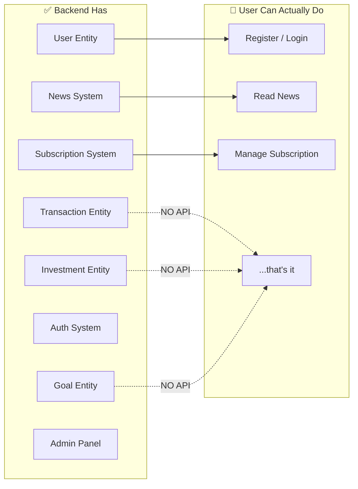
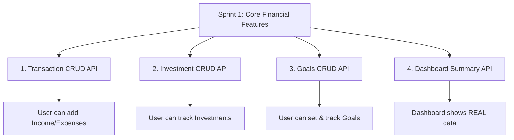

# What Should This App Actually Do? — Complete Product Vision

## The Core Problem Right Now

Let me map exactly what **exists in your backend** vs **what a user can actually do**:



### The Gap Is Massive

| Domain Entity | DB Table Exists? | API Controller? | User Can Use? |
|:---|:---:|:---:|:---:|
| User (register/login) | ✅ | ✅ | ✅ |
| News (finance + today) | ✅ | ✅ | ✅ |
| Subscription/Plans/Features | ✅ | ✅ | ✅ |
| Admin (users/roles) | ✅ | ✅ | ✅ (admin only) |
| Banners | ✅ | ✅ | ✅ |
| **Transaction** (Income/Expense) | ✅ | ❌ **NONE** | ❌ |
| **Investment** | ✅ | ❌ **NONE** | ❌ |
| **Goal** | ✅ | ❌ **NONE** | ❌ |
| **User Profile/Settings** | Partial | ❌ **NONE** | ❌ |
| **Dashboard Analytics** | ❌ | ❌ **NONE** | ❌ |
| **Export Data** | ❌ | ❌ **NONE** | ❌ |

> [!CAUTION]
> **Your 3 core financial entities (Transaction, Investment, Goal) already exist in the database but have ZERO API endpoints.** The user literally cannot input or view any financial data. The app is currently an auth + news reader + subscription manager — not a financial application.

---

## What This App Should Be — Product Vision

**FinancialApp** should be a **personal finance management platform** where users can:

```
┌─────────────────────────────────────────────────────────────────┐
│                    USER JOURNEY MAP                             │
│                                                                 │
│  1. SIGN UP ──→ 2. ONBOARD ──→ 3. USE DAILY ──→ 4. GROW       │
│                                                                 │
│  Register       Set currency    Add income/      Track goals    │
│  Login (2FA)    Set budget      expenses daily   See insights   │
│  Pick plan      Add goals       Track invest.    Export reports  │
│                 Link accounts   Read fin. news   Upgrade plan   │
└─────────────────────────────────────────────────────────────────┘
```

---

## Page-by-Page: What Each Screen Should Do

### 📊 1. Dashboard (Currently: Empty / Static)

**What it should show (all from real user data):**

| Widget | Data Source | Description |
|:---|:---|:---|
| **Monthly Balance** | Transactions | Income − Expenses this month |
| **Income vs Expense Chart** | Transactions | Bar/Line chart for last 6 months |
| **Expense by Category** | Transactions | Pie/Donut chart (Food, Rent, Transport, etc.) |
| **Active Goals Progress** | Goals | Progress bars for each goal |
| **Investment Portfolio** | Investments | Total invested, current value, gain/loss % |
| **Recent Transactions** | Transactions | Last 5-10 transactions quick list |
| **Budget Alert** | Transactions + Settings | "You've spent 80% of your Food budget" |
| **Financial News** | FinanceNews API (already done ✅) | Top 3-5 headlines |

**API Endpoints Needed:**
```
GET /api/dashboard/summary          → monthly income, expense, balance, savings rate
GET /api/dashboard/monthly-trend    → last 6-12 months income vs expense
GET /api/dashboard/category-breakdown → expense breakdown by category (current month)
GET /api/dashboard/recent-activity  → last N transactions + goal updates
```

---

### 💰 2. Transactions Page (Currently: Does Not Exist)

**This is the CORE of the app — where users input their financial data.**

**What users should be able to do:**
- ➕ **Add Income**: Salary, Freelance, Gift, Refund, Interest, Rental, Other
- ➖ **Add Expense**: Food, Rent, Transport, Shopping, Bills, Healthcare, Education, Entertainment, Travel, Other
- 📋 **View All Transactions**: Sortable table with filters
- 🔍 **Filter**: By date range, category, type (income/expense), amount range
- ✏️ **Edit** a transaction
- 🗑️ **Delete** a transaction
- 📊 **Monthly Summary**: Total income, total expense, net at the top

**Your existing entity already supports this:**
```csharp
// Already in your codebase! Just needs API + Service
public class Transaction
{
    public Guid TransactionId { get; set; }
    public Guid UserId { get; set; }           // Links to logged-in user
    public decimal Amount { get; set; }
    public string Category { get; set; }       // "Food", "Salary", etc.
    public string Description { get; set; }    // "Lunch at restaurant"
    public DateTime TransactionDate { get; set; }
    public TransactionTypeEnum TransactionType { get; set; } // Income=1, Expense=2
}
```

**API Endpoints Needed:**
```
POST   /api/transactions              → Add new transaction
GET    /api/transactions              → List with filters, pagination, sorting
GET    /api/transactions/{id}         → Get single transaction detail
PUT    /api/transactions/{id}         → Update a transaction
DELETE /api/transactions/{id}         → Delete a transaction
GET    /api/transactions/summary      → Monthly totals (income, expense, net)
GET    /api/transactions/categories   → List of available categories
```

**New Domain Enhancements Needed:**
- Add a `Category` entity (or use a predefined list) with icons
- Add `PaymentMethod` field (Cash, UPI, Card, NetBanking)
- Add `IsRecurring` flag for recurring bills
- Add `Tags` support for custom labeling

---

### 📈 3. Investments Page (Currently: Does Not Exist)

**What users should be able to do:**
- ➕ **Add Investment**: Stocks, Mutual Funds, Fixed Deposit, Gold, Crypto, Real Estate, PPF, NPS
- 📋 **View Portfolio**: All investments in a table/card view
- 📊 **Portfolio Summary**: Total invested, current value, total gain/loss
- ✏️ **Update**: Change status, add returns, update current value
- 🗑️ **Close/Delete** an investment

**Your existing entity:**
```csharp
// Already exists! Needs API + some field additions
public class Investment
{
    public Guid InvestmentId { get; set; }
    public Guid UserId { get; set; }
    public decimal Amount { get; set; }          // Amount invested
    public string InvestmentType { get; set; }   // "Stocks", "MutualFund", etc.
    public DateTime StartDate { get; set; }
    public DateTime EndDate { get; set; }
    public string Status { get; set; }           // "Active", "Matured", "Sold"
}
```

**Suggested Entity Enhancements:**
```csharp
// Fields to ADD to the Investment entity:
public string Name { get; set; }              // "HDFC Equity Fund", "TCS Shares"
public decimal CurrentValue { get; set; }     // Track current worth
public decimal? Returns { get; set; }         // Profit/Loss amount
public decimal? ReturnPercentage { get; set; }// ROI %
public string? Notes { get; set; }            // User notes
```

**API Endpoints Needed:**
```
POST   /api/investments              → Add new investment
GET    /api/investments              → List all with filters
GET    /api/investments/{id}         → Get single investment
PUT    /api/investments/{id}         → Update investment
DELETE /api/investments/{id}         → Delete/close investment
GET    /api/investments/summary      → Portfolio total, gain/loss, by type breakdown
```

---

### 🎯 4. Goals Page (Currently: Does Not Exist)

**What users should be able to do:**
- ➕ **Create Goal**: "Save ₹5,00,000 for vacation by Dec 2027"
- 💵 **Add Money to Goal**: Manual contributions toward a goal
- 📊 **Track Progress**: Visual progress bar (CurrentAmount / TargetAmount)
- ✏️ **Update Goal**: Change target, deadline, title
- ✅ **Complete/Fail**: Mark goal status

**Your existing entity:**
```csharp
// Already exists! Needs API only
public class Goal
{
    public Guid GoalId { get; set; }
    public Guid UserId { get; set; }
    public string Title { get; set; }             // "Emergency Fund"
    public decimal TargetAmount { get; set; }     // ₹5,00,000
    public decimal CurrentAmount { get; set; }    // ₹1,50,000  (30%)
    public DateTime Deadline { get; set; }
    public GoalStatusEnum Status { get; set; }    // NotStarted, InProgress, Completed, Failed
}
```

**Suggested Entity Enhancements:**
```csharp
// Fields to ADD:
public string? Description { get; set; }      // Why this goal matters
public string? Icon { get; set; }             // "🏠", "✈️", "🚗", "💰"
public string? Color { get; set; }            // For UI card color
public decimal? MonthlyTarget { get; set; }   // Auto-calculated: how much to save/month
```

**API Endpoints Needed:**
```
POST   /api/goals                    → Create a new goal
GET    /api/goals                    → List all goals (with progress %)
GET    /api/goals/{id}               → Get single goal detail
PUT    /api/goals/{id}               → Update goal details
DELETE /api/goals/{id}               → Delete a goal
POST   /api/goals/{id}/contribute    → Add money to a goal
POST   /api/goals/{id}/status        → Change status (complete/fail)
```

---

### 👤 5. User Profile Page (Currently: Empty)

**What it should show:**

| Section | Fields | Actions |
|:---|:---|:---|
| **Profile Info** | Username, Email, Profile Picture, Member Since | Edit username, upload avatar |
| **Account Security** | 2FA status, Recovery codes, Last login | Regenerate recovery codes, reset TOTP |
| **Subscription** | Current plan, billing cycle, next renewal | View plan, upgrade/downgrade link |
| **Activity** | Total transactions, active investments, goal progress | - |

**API Endpoints Needed:**
```
GET    /api/profile                  → Get current user profile + stats
PUT    /api/profile                  → Update profile (username, etc.)
POST   /api/profile/avatar           → Upload/change profile picture
PUT    /api/profile/password         → Change password
GET    /api/profile/activity-summary → Account-wide stats
```

---

### ⚙️ 6. Settings Page (Currently: Empty)

**What it should contain:**

| Section | Settings | Storage |
|:---|:---|:---|
| **General** | Currency (₹/$/€), Language, Timezone, Date format | New `UserSettings` entity |
| **Budget** | Monthly budget limit, category budgets, alerts threshold | New `Budget` entity |
| **Notifications** | Email for payment reminders, goal deadlines, weekly summary | `UserSettings` |
| **Categories** | Custom transaction categories (add/rename/delete/reorder) | New `UserCategory` entity |
| **Privacy** | Data export (GDPR), Delete account | Use existing entities |
| **Appearance** | Dark/Light mode, accent color | `UserSettings` (or frontend-only) |

**New Entities Needed:**
```csharp
// NEW ENTITY: UserSettings
public class UserSettings
{
    public Guid Id { get; set; }
    public Guid UserId { get; set; }
    public string Currency { get; set; } = "INR";        // INR, USD, EUR
    public string Timezone { get; set; } = "Asia/Kolkata";
    public string DateFormat { get; set; } = "dd/MM/yyyy";
    public string Language { get; set; } = "en";
    public bool EmailNotifications { get; set; } = true;
    public bool WeeklySummaryEmail { get; set; } = false;
    public string Theme { get; set; } = "dark";          // dark/light
}

// NEW ENTITY: Budget
public class Budget
{
    public Guid Id { get; set; }
    public Guid UserId { get; set; }
    public string Category { get; set; }                  // "Food", "Overall", etc.
    public decimal MonthlyLimit { get; set; }
    public decimal AlertThreshold { get; set; } = 0.8m;  // Alert at 80%
    public bool IsActive { get; set; } = true;
}
```

**API Endpoints Needed:**
```
GET    /api/settings                 → Get all user settings
PUT    /api/settings                 → Update settings
GET    /api/settings/categories      → Get user's custom categories
POST   /api/settings/categories      → Add custom category
DELETE /api/settings/categories/{id} → Delete custom category
GET    /api/budgets                  → Get all budgets
POST   /api/budgets                  → Create/update a budget
DELETE /api/budgets/{id}             → Remove a budget
GET    /api/budgets/status           → Current month: spent vs budget per category
```

---

### 📄 7. Reports & Export (Currently: Does Not Exist)

**What users should be able to do:**
- 📊 Monthly/Yearly financial report
- 📥 Export transactions to CSV/Excel
- 📥 Export investment portfolio
- 📈 Income vs Expense trends (charts)
- 🏷️ Spending by category over time

**API Endpoints Needed:**
```
GET /api/reports/monthly?year=2026&month=8     → Monthly detailed report
GET /api/reports/yearly?year=2026              → Yearly summary
GET /api/reports/category-trend?months=6       → Category spending over time
GET /api/export/transactions?format=csv        → Download CSV
GET /api/export/investments?format=csv         → Download CSV
```

---

## Implementation Priority — What to Build First

### 🏃 Sprint 1: Make the App Functional (Core Financial Data)

> [!IMPORTANT]
> **Build these first. Without them, the app has no purpose.**



| Task | Entities | New Files | Est. Time |
|:---|:---|:---|:---|
| Transaction Service + Controller | Existing `Transaction` | `ITransactionService`, `TransactionService`, `TransactionController`, 4-5 DTOs | 5-6 hrs |
| Investment Service + Controller | Existing `Investment` + enhancements | `IInvestmentService`, `InvestmentService`, `InvestmentController`, 4-5 DTOs | 5-6 hrs |
| Goal Service + Controller | Existing `Goal` | `IGoalService`, `GoalService`, `GoalController`, 4-5 DTOs | 4-5 hrs |
| Dashboard Summary API | Aggregation queries | `IDashboardService`, `DashboardService`, `DashboardController`, 3-4 DTOs | 4-5 hrs |

---

### 🏃 Sprint 2: User Profile & Settings

| Task | New Entities | Est. Time |
|:---|:---|:---|
| User Profile API (view/edit/avatar) | Extend `User` | 3-4 hrs |
| User Settings entity + API | **New** `UserSettings` | 3-4 hrs |
| Budget entity + API | **New** `Budget` | 3-4 hrs |
| Change Password API | Use existing `User` | 2 hrs |

---

### 🏃 Sprint 3: Analytics & Reports

| Task | Dependencies | Est. Time |
|:---|:---|:---|
| Monthly/Yearly report API | Transaction data | 3-4 hrs |
| Category trend API | Transaction data | 2-3 hrs |
| CSV/Excel export | Transaction + Investment data | 3-4 hrs |
| Budget vs Actual tracking | Budget + Transaction data | 2-3 hrs |

---

### 🏃 Sprint 4: Polish & Advanced Features

| Task | Est. Time |
|:---|:---|
| Recurring transactions (auto-add monthly rent, salary, etc.) | 4-5 hrs |
| Notifications (email alerts for budget limits, goal deadlines) | 4-5 hrs |
| Payment gateway integration (Razorpay) | 5-6 hrs |
| Data import from CSV/bank statement | 4-5 hrs |

---

## Open Questions

> [!IMPORTANT]
> Your answers will shape exactly what I build:

1. **Should I start with Sprint 1 (Transaction + Investment + Goal APIs)?** This is the most impactful change — it turns your app from a news reader into an actual financial tool.

2. **Do you want predefined categories or custom categories for transactions?**
   - Predefined: Food, Transport, Rent, Bills, Shopping, Entertainment, Healthcare, Education, Salary, Freelance, Gift, Interest, Other
   - Custom: User can create their own
   - Both: Start with predefined, allow custom additions

3. **What currency is primary?** Your entities already default to INR — should we support multi-currency?

4. **Should investments track real-time prices** (via an external API like stock market data), or is manual entry enough for now?

5. **Do you want me to also update the frontend**, or focus only on the backend APIs first?
